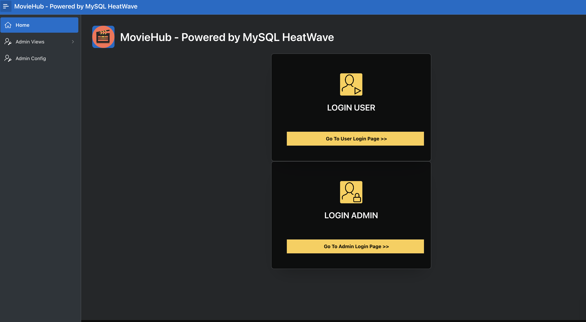
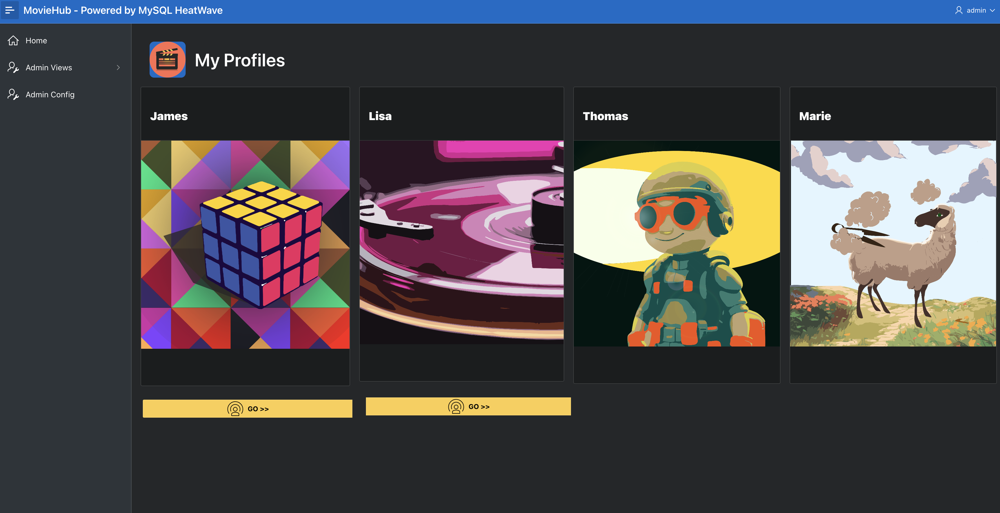
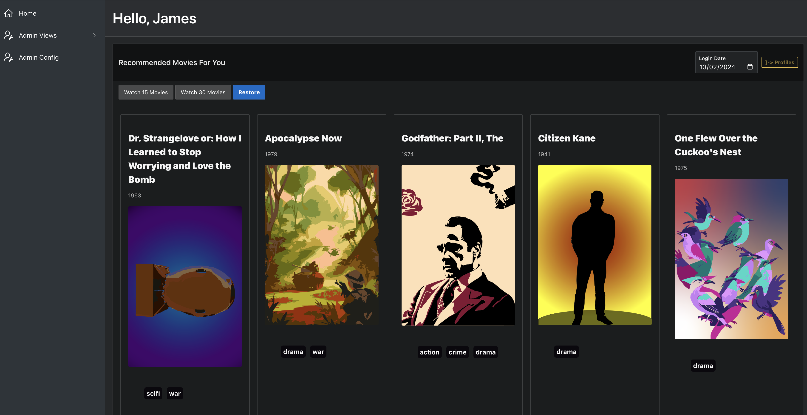
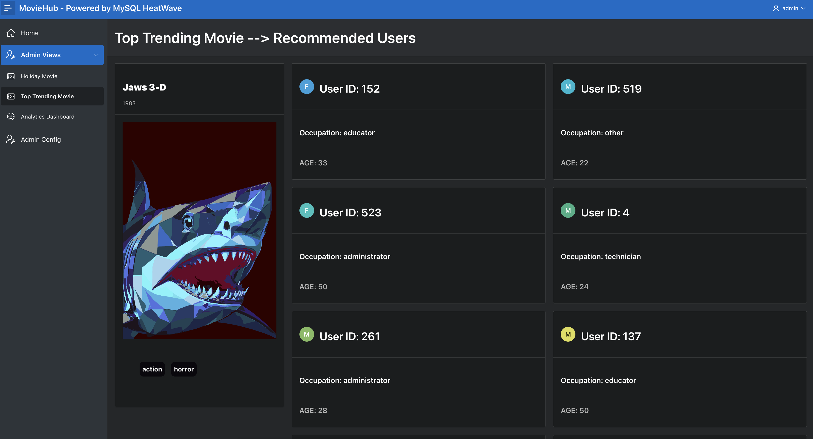
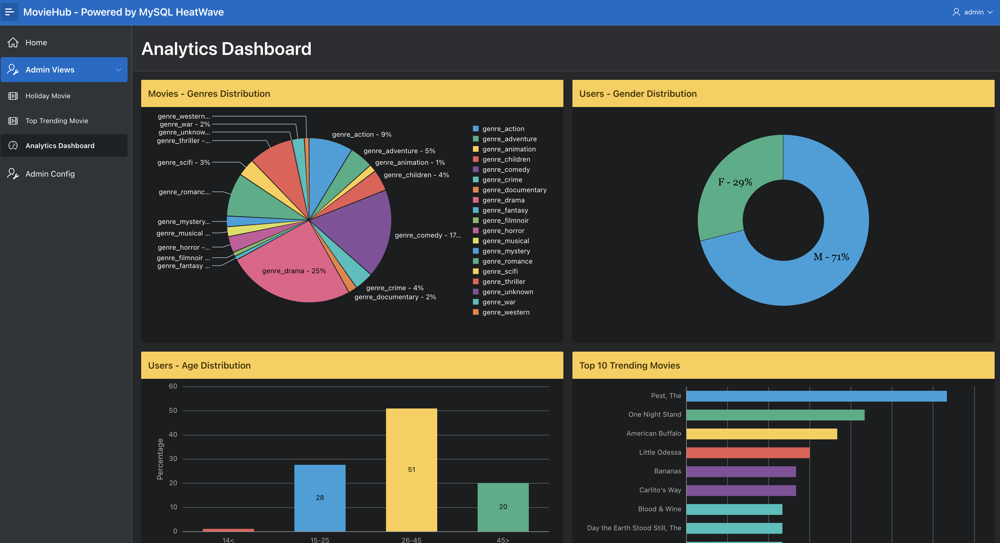

# MovieHub

The MySQL HeatWave MovieHub Application project is a collaborative effort to showcase the seamless integration between MySQL HeatWave and Oracle APEX. This integration empowers developers to build sophisticated web-based applications with robust data analytics capabilities. By harnessing the power of MySQL HeatWave's AutoML features and Oracle APEX's low-code development environment, this project aims to demonstrate the potential of combining these technologies to create intuitive and powerful applications for data analysis and visualization.

## Acknowledgements

 - [Oracle Cloud](https://docs.oracle.com/en/cloud/get-started/index.html)
 - [Oracle Application Express (APEX)](https://docs.oracle.com/cd/E17781_01/doc.112/e18644/intro_app.htm#TDPAX01000)
 - [MySQL HeatWave](https://www.mysql.com/products/mysqlheatwave/)

## API Reference

##### The project does not expose external APIs. However, it demonstrates the configuration of REST Enabled SQL Services within Oracle APEX to communicate with MySQL HeatWave databases.

## Badges

## Features
### MovieHub  Application

MovieHub is a comprehensive sample application designed to showcase the seamless integration between MySQL HeatWave and Oracle APEX. As a robust blueprint, MovieHub demonstrates how MySQL HeatWave serves as a powerful backend data source for APEX applications, offering a myriad of functionalities for browsing, analyzing, and reporting on movie data.

### 1. Seamless Integration
- Effortlessly integrates MySQL HeatWave with Oracle APEX.
- Demonstrates the smooth interaction between the two platforms.
- Leverages advanced capabilities of MySQL HeatWave for enhanced data handling.

### 2. Functionalities Showcase
- Presents a wide range of functionalities tailored for browsing, analyzing, and reporting on movie data.
- Enables users to perform simple data queries and complex predictive analytics.
- Highlights the versatility and power of MySQL HeatWave as a backend data source.

### 3. AutoML Capabilities
- Showcases the utilization of MySQL HeatWave's AutoML capabilities within APEX applications.
- Empowers users to drive predictive analytics and gain data-driven insights.
- Provides valuable insights into movie trends, preferences, and predictions.

### 4. Efficient Data Retrieval
- Guides users through the configuration of REST Enabled SQL Services within APEX for efficient data retrieval.
- Ensures real-time data updates and synchronization with MySQL HeatWave databases.
- Enhances data accessibility and usability through optimized RESTful APIs.

### 5. User Management and Access Control
- Covers essential aspects of user management within APEX.
- Facilitates the creation of administrator accounts and assignment of roles for access control.
- Provides granular control over user privileges to ensure secure and efficient access to application features.

### 6. Enhanced Web Service Requests
- Offers instructions for increasing the limit of outbound web service requests per APEX workspace in Oracle Autonomous Database.
- Enhances scalability and ensures uninterrupted access to web services.
- Facilitates seamless interaction with external APIs and data sources.

With its comprehensive features and seamless integration capabilities, MovieHub serves as a valuable resource for developers looking to harness the power of MySQL HeatWave and Oracle APEX in their applications.
## Tech Stack

**Database:** MySQL HeatWave

**Integration and Development Tools:** Oracle APEX, Oracle REST Enabled SQL Services

**Cloud Services:** Oracle Cloud Infrastructure (OCI)

## Screenshots

